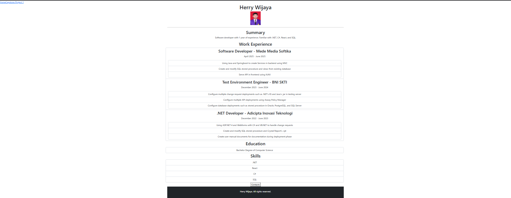
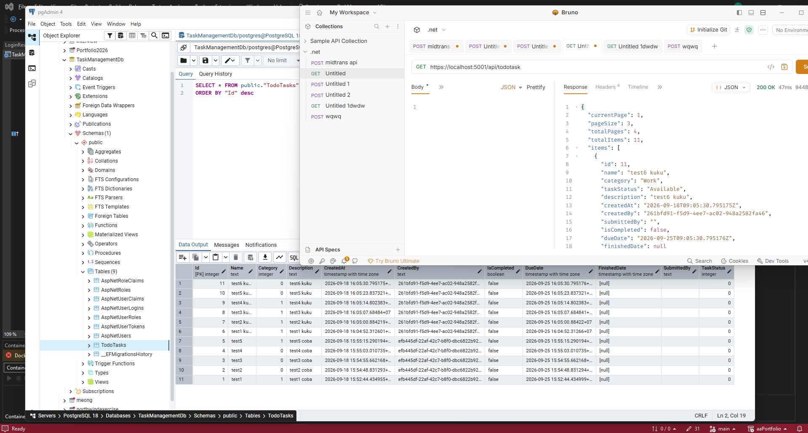
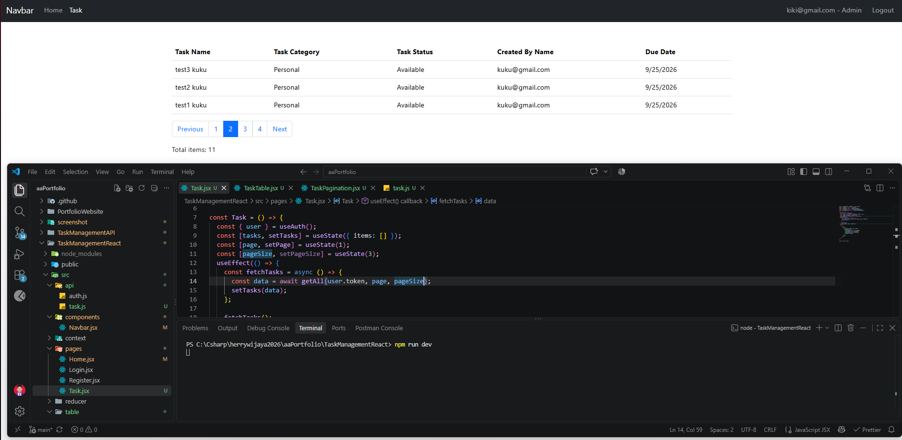

# My Portfolio

A personal portfolio website built with React, React Router, and Bootstrap for frontend and C#, .NET WebAPI, and PostgreSQL for backend.
Using EFCore Identity for Authentication and Authorization.

## 🚀 Projects

1. Capstone Project 1 | My Resume
   

2. Task Management React + API
   
   

## 📦 Installation

Clone the repository:

git clone https://github.com/Zodiark619/aaPortfolio.git

Go into the project directory:

cd my-portfolio

Install dependencies:

npm install

Start the development server:

npm run dev

The application will normally be available at:

http://localhost:5173

## 🛠️ Development

Run the development server:

npm run dev

Build the application:

npm run build

Preview the production build:

npm run preview

## 📄 License

This project is for personal portfolio purposes.
